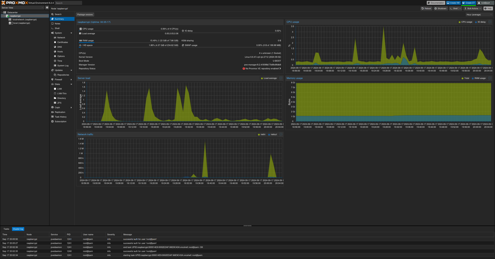
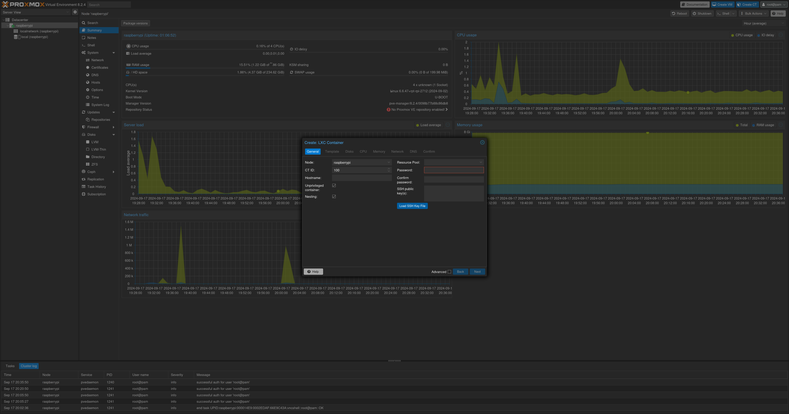
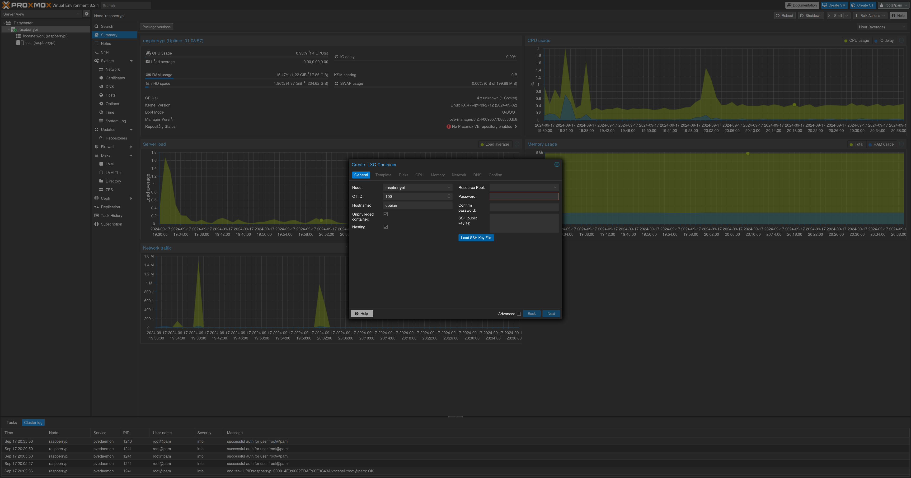
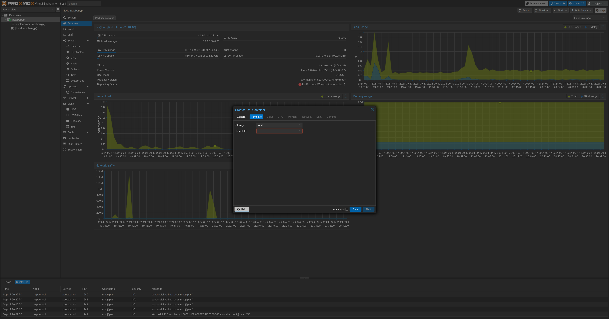
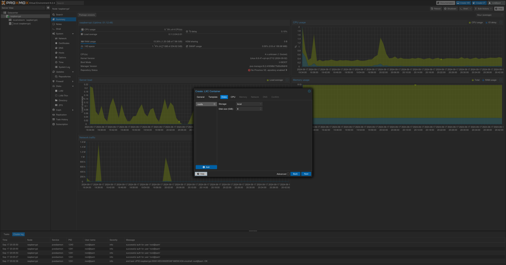
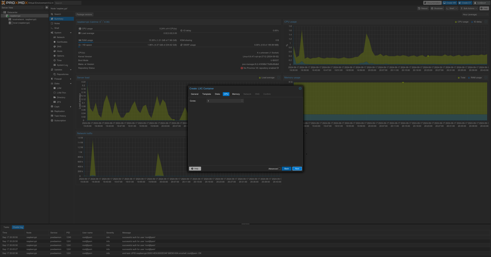
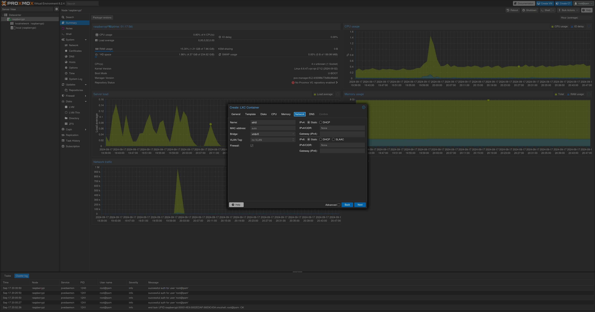

# Proxmox on Raspberry Pi 5

Step-by-step guide to install a proxmox port on the rpi5
----------

#### This has been written after my troubleshooting, so the only source I can mention is [this](https://github.com/pimox/pimox7).

<!-- TOC -->
* [Proxmox on Raspberry Pi 5](#proxmox-on-raspberry-pi-5)
  * [Step-by-step guide to install a proxmox port on the rpi5](#step-by-step-guide-to-install-a-proxmox-port-on-the-rpi5)
      * [This has been written after my troubleshooting, so the only source I can mention is this.](#this-has-been-written-after-my-troubleshooting-so-the-only-source-i-can-mention-is-this)
  * [Prerequisites](#prerequisites)
  * [Step 1 - Preparation](#step-1---preparation)
  * [Step 2 - Proxmox installation](#step-2---proxmox-installation)
      * [Run the following commands:](#run-the-following-commands)
  * [Step 3 - Proxmox LXC creation](#step-3---proxmox-lxc-creation)
      * [Follow these steps to create a Proxmox container:](#follow-these-steps-to-create-a-proxmox-container)
          * [Adding the CT Template:](#adding-the-ct-template)
          * [Adding the CT Template (via GUI):](#adding-the-ct-template-via-gui)
<!-- TOC -->

Prerequisites
---------
- Raspberry Pi 5
- An SD card
- A computer with internet connection
- An ethernet cable for the pi

Step 1 - Preparation
--------

Flash the original Raspberry Pi OS 64BIT Lite version on an SD card. **Make sure to bind also the Wi-Fi network** during the installation otherwise you may face network issues during the installation. Set the hostname and write it down somewhere.
When the SD is ready plug it into the SD card reader, plug the ethernet cable, turn it on and connect to it. Connecting to it via HDMI and keyboard is fine; but if you can't, remember not to use the ethernet IP address but rather the Wi-Fi one.

Step 2 - Proxmox installation
--------

#### Run the following commands:

1. `sudo -s`
2. `apt update`
3. `apt upgrade -y`
4. `curl https://mirrors.apqa.cn/proxmox/debian/pveport.gpg -o
/etc/apt/trusted.gpg.d/pveport.gpg` if this results in an error, remove the `https` and try with `http`
5. `echo "deb https://mirrors.apqa.cn/proxmox/debian/pve bookworm port" | tee -a
/etc/apt/sources.list` here as well
6. `apt update`
7. `apt dist-upgrade -y`
8. `nano /etc/network/interfaces`
9. inside comment everything and write:
```
auto lo
iface lo inet loopback

iface eth0 inet manual

auto vmbr0
iface vmbr0 inet static
    address 192.168.1.100/24
    gateway 192.168.0.1
    bridge-ports eth0
    bridge-stp off
    bridge-fd 0
```
In the address write an ip for proxmox (choose one that is unused on your local network) and the netmask in the CIDR notation.
In the gateway put the router ip

10. `nano /etc/hosts`
11. delete everything inside and write:
```
127.0.0.1       localhost
192.168.1.100   raspberrypi
```
Change the second ip address with the one you've set in the `/etc/network/interfaces` file and `raspberrypi` with the hostname you've written down during the installation (or use `hostname` to find it)

12. `reboot now`
13. `sudo -s`
14. `apt install pve-qemu-kvm proxmox-ve -y` if you face any issue, try installing `pve-qemu-kvm` first and then `proxmox-ve`
15. `reboot now`
16. `sudo -s`
17. `curl https://raw.githubusercontent.com/pimox/pimox7/master/RPiOS64-IA-Install.sh > installer.sh`
18. `chmod +x installer.sh`
19. `./installer.sh`
20. Now there will be asked some questions:
21. `Enter new hostname e.g. RPi4-01-PVE :` enter the hostname (or a new one) you have written down during the installation, in my case: `raspberrypi`
22. `Enter new static IP and NETMASK e.g. 192.168.0.100/24 :` enter the ip and the netmask set in the file `/etc/network/interfaces`, in my case: `192.168.1.100/24`
23. `Is 192.168.1.1 the correct gateway ?  y / n :` check if the gateway shown matches the gateway set in the file `/etc/network/interfaces`
24. `YOU ARE OKAY WITH THESE CHANGES ? YOUR DECLARATIONS ARE CORRECT ? CONTINUE ? y / n : ` check if everything is fine, then reply `y`
25. after this, set the root password and wait until it reboots
26. after having logged in run `sudo -s`
27. `apt upgrade -y`
28. `reboot now`
29. now open the ip address specified in the `/etc/network/interfaces` file followed by the port 8006 in your browser on your computer. In my case: `https://192.168.1.100:8006`
30. Proxmox has successfully been installed and is redy to use

Step 3 - Proxmox LXC creation
--------

#### Follow these steps to create a Proxmox container:

###### Adding the CT Template:

1. ssh into the pi. now use the root address, so in my case `ssh root@192.168.1.100`
2. install git using `apt install git`
2. clone this repo wherever you like using `git clone https://github.com/DanieleMassa/proxmoxOnRPI5`
2. `cd proxmoxOnRPI5`
3. `mv OS_PROXMOX_DEBIAN12.tar.xz /var/lib/vz/template/cache/`

###### Creating the container:



1. click on `Create CT` in the top right corner



2. in the `Hostname` textbox write the container name, in my case `debian`



3. set a password and confirm it, then click Next



4. in the `Template` select the `OS_PROXMOX_DEBIAN12.tar.xz` file you've downloaded early, then click Next



5. select the disk size and click Next



6. select the number of cores and click Next


7. choose how much RAM and SWAP your container should have and click Next



8. leave the network and the DNS as it is and click Next. Then click Finish to create the container


    
