# Proxmox on Raspberry Pi 5

Step-by-step guide to install a proxmox port on the rpi5
----------

#### This has been written after my troubleshooting, so the only source I can mention are [this](https://github.com/pimox/pimox7) one and [this](https://mirrors.apqa.cn) one. The debian template has been downloaded from [this](https://mirrors.apqa.cn/proxmox/) website

<!-- TOC -->
* [Proxmox on Raspberry Pi 5](#proxmox-on-raspberry-pi-5)
   * [Prerequisites](#prerequisites)
  * [Step 1 - Preparation](#step-1---preparation)
  * [Step 2 - Proxmox installation](#step-2---proxmox-installation)
  * [Step 3 - Proxmox LXC creation](#step-3---proxmox-lxc-creation)
      * [Follow these steps to create a Proxmox container](#follow-these-steps-to-create-a-proxmox-container)
          * [Adding the CT Template](#adding-the-ct-template)
          * [Creating the container](#creating-the-container)
  * [Step 4 - Proxmox VM creation](#step-4---proxmox-vm-creation)
  * [Miscellaneous](#miscellaneous)
      * [Deactivate all LEDs](#deactivate-all-leds)
      * [LXC Filesystem Trimming](#lxc-filesystem-trimming)
      * [Add subscription](#add-subscription)
      * [Disable sticky subscription alert](#sticky-subscription-alert)
<!-- TOC -->

Prerequisites
---------
- Raspberry Pi 5
- An SD card
- A computer with internet connection
- An ethernet cable for the pi

Step 1 - Preparation
--------

Flash the original Raspberry Pi OS 64BIT Lite version on an SD card. **Make sure to bind also the Wi-Fi network** during the installation otherwise you may face network issues during the installation. Set the hostname and write it down somewhere.
When the SD is ready plug it into the SD card reader, plug the ethernet cable, turn it on and connect to it. Connecting to it via HDMI and keyboard is fine; but if you can't, remember not to use the ethernet IP address but rather the Wi-Fi one.

Step 2 - Proxmox installation
--------

#### Run the following commands

1. `sudo -s`
2. `apt update`
3. `apt upgrade -y`
4. `curl https://mirrors.apqa.cn/proxmox/debian/pveport.gpg -o
/etc/apt/trusted.gpg.d/pveport.gpg` if this results in an error, remove the `https` and try with `http`
5. `echo "deb https://mirrors.apqa.cn/proxmox/debian/pve bookworm port" | tee -a
/etc/apt/sources.list` here as well
6. `apt update`
7. `apt dist-upgrade -y`
8. `nano /etc/network/interfaces`
9. inside comment everything and write:
```
auto lo
iface lo inet loopback

iface eth0 inet manual

auto vmbr0
iface vmbr0 inet static
    address 192.168.1.100/24
    gateway 192.168.0.1
    bridge-ports eth0
    bridge-stp off
    bridge-fd 0
```
In the address write an ip for proxmox (choose one that is unused on your local network) and the netmask in the CIDR notation.
In the gateway put the router ip

10. `nano /etc/hosts`
11. delete everything inside and write:
```
127.0.0.1       localhost
192.168.1.100   raspberrypi
```
Change the second ip address with the one you've set in the `/etc/network/interfaces` file and `raspberrypi` with the hostname you've written down during the installation (or use `hostname` to find it)

12. `reboot now`
13. `sudo -s`
14. `apt install pve-qemu-kvm proxmox-ve -y` if you face any issue, try installing `pve-qemu-kvm` first and then `proxmox-ve`
15. `reboot now`
16. `sudo -s`
17. `curl https://raw.githubusercontent.com/pimox/pimox7/master/RPiOS64-IA-Install.sh > installer.sh`
18. `chmod +x installer.sh`
19. `./installer.sh`
20. Now there will be asked some questions:
21. `Enter new hostname e.g. RPi4-01-PVE :` enter the hostname (or a new one) you have written down during the installation, in my case: `raspberrypi`
22. `Enter new static IP and NETMASK e.g. 192.168.0.100/24 :` enter the ip and the netmask set in the file `/etc/network/interfaces`, in my case: `192.168.1.100/24`
23. `Is 192.168.1.1 the correct gateway ?  y / n :` check if the gateway shown matches the gateway set in the file `/etc/network/interfaces`
24. `YOU ARE OKAY WITH THESE CHANGES ? YOUR DECLARATIONS ARE CORRECT ? CONTINUE ? y / n : ` check if everything is fine, then reply `y`
25. after this, set the root password and wait until it reboots
26. after having logged in run `sudo -s`
27. `apt upgrade -y`
28. `reboot now`
29. now open the ip address specified in the `/etc/network/interfaces` file followed by the port 8006 in your browser on your computer. In my case: `https://192.168.1.100:8006`
30. Proxmox has successfully been installed and is redy to use

Step 3 - Proxmox LXC creation
--------

#### Follow these steps to create a Proxmox container

###### Adding the CT Template

1. ssh into the pi. now use the root address, so in my case `ssh root@192.168.1.100`
2. install git using `apt install git`
2. clone this repo wherever you like using `git clone https://github.com/DanieleMassa/proxmoxOnRPI5`
2. `cd proxmoxOnRPI5`
3. `mv OS_PROXMOX_DEBIAN12.tar.xz /var/lib/vz/template/cache/`

###### Creating the container

1. Click on `Create CT` in the top right corner

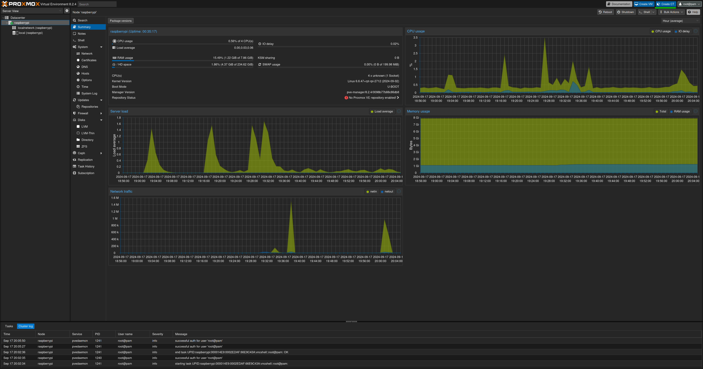

2. In the `Hostname` textbox write the container name, in my case `debian`


3. Set a password and confirm it, then click `Next`


4. In the `Template` select the `OS_PROXMOX_DEBIAN12.tar.xz` file you've downloaded early, then click `Next`


5. Select the disk size and click `Next`


6. Select the number of cores and click `Next`


7. Choose how much RAM and SWAP your container should have and click `Next`


8. Leave the network and the DNS as it is and click `Next`. Then click `Finish` to create the container


Step 4 - Proxmox VM creation
--------

1. Click on `local (hostname)` in the left tab, then select ISO Images

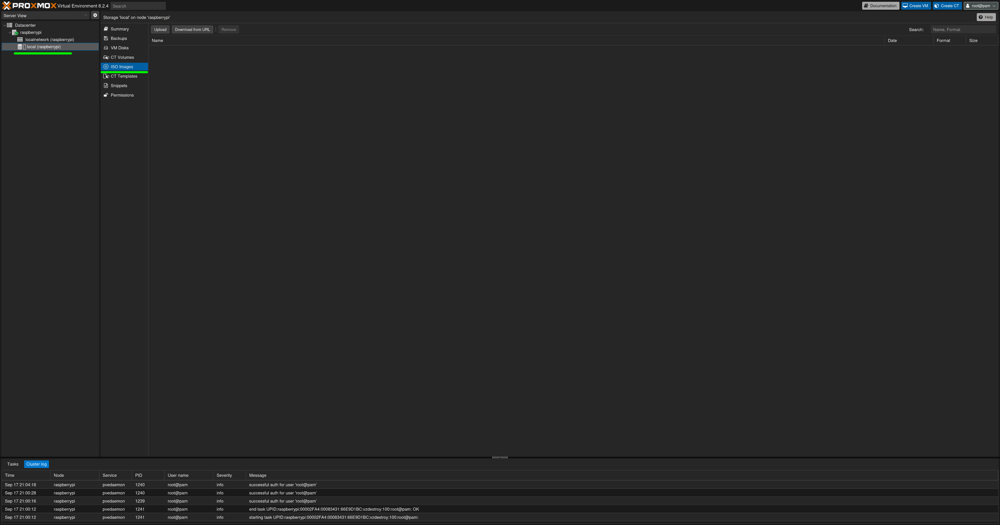

2. Look for an arm64 ISO image and copy the download link
3. Then click on `Download from URL`, paste the link and click on `Query URL`, then `Download`. I'll be using [debian](https://cdimage.debian.org/debian-cd/current/arm64/iso-cd/debian-12.7.0-arm64-netinst.iso)

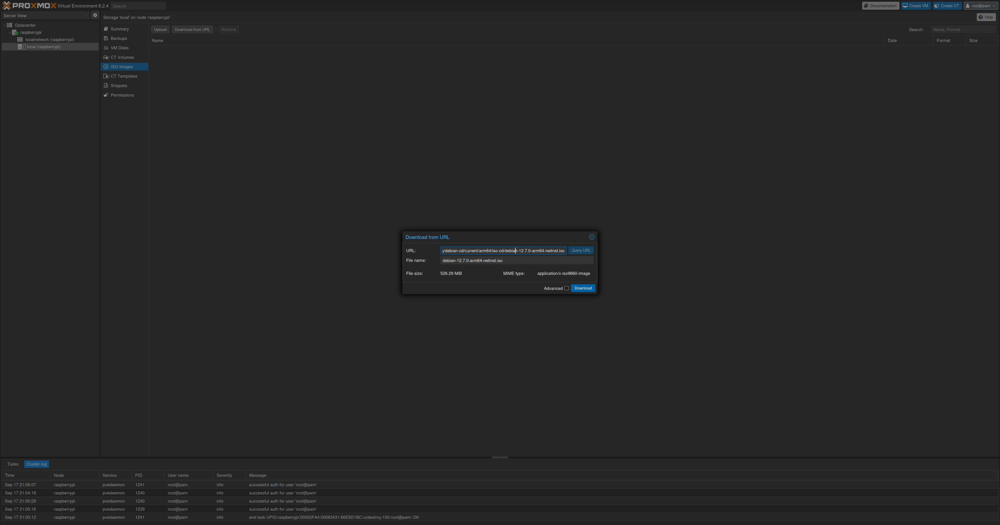

4. Now click on `Create VM` in the top right corner and enter a hostname. Then click `Next`

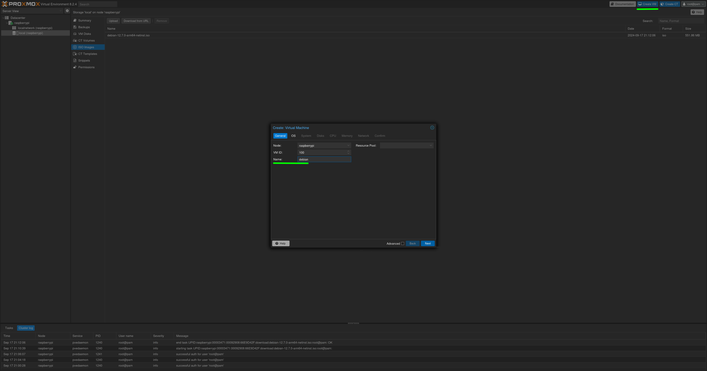

5. On the OS tab click on `Do not use any media`, then click `Next`

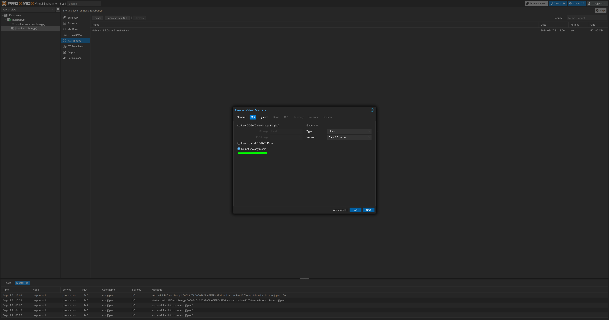

6. Leave the System tab as default and choose the disk size in the Disks tab, then click `Next`

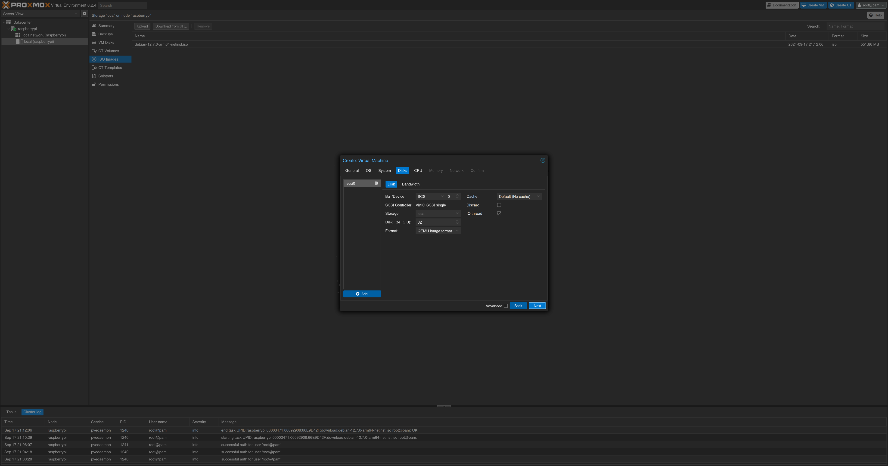

7. Choose the number of core and click `Next`

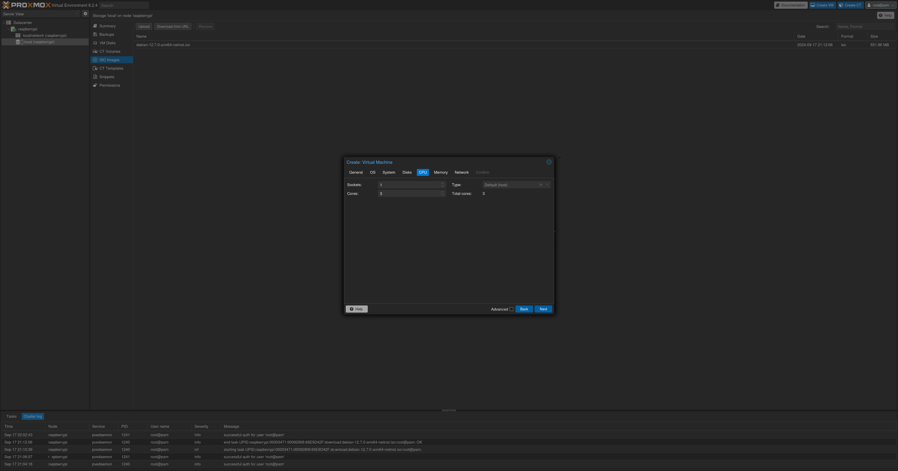

8. Choose the RAM amount and click `Next`

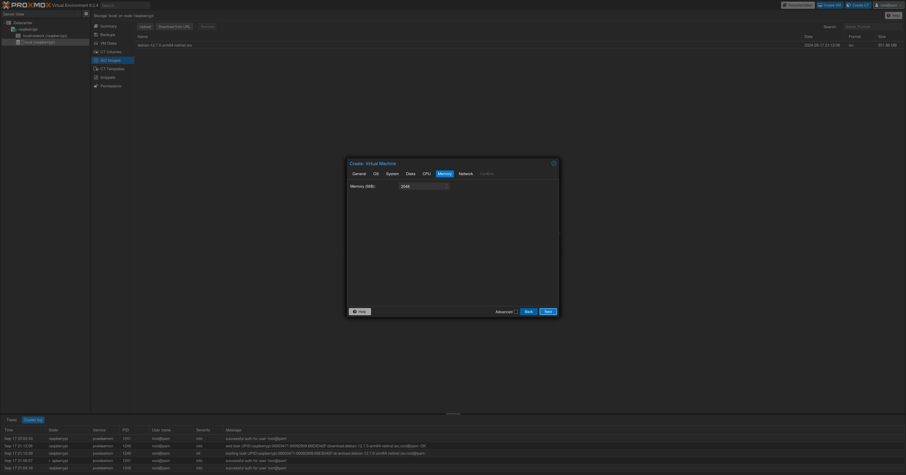

9. Leave the Network tab as default and click on `Finish` to create the VM

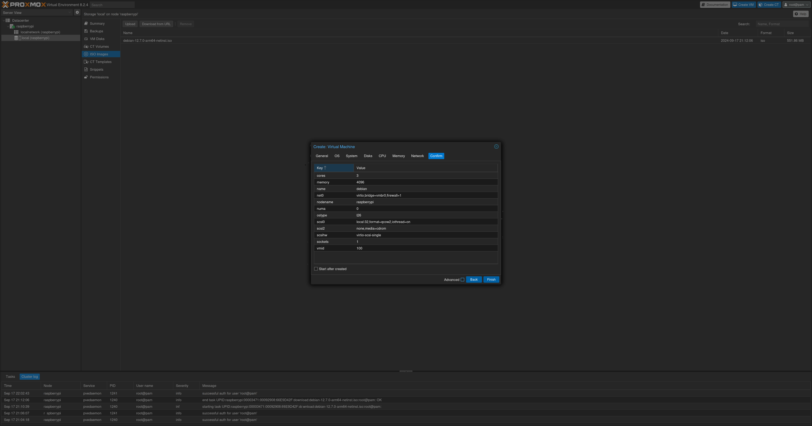

10. Once created, open the Hardware configuration and edit the `BIOS`, setting it to `OVMF (UEFI)`

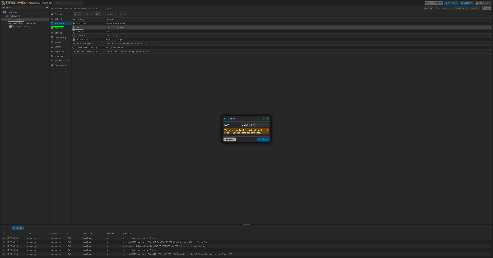

11. Now delete the existing `CD/DVD Drive` and create a new one, setting the `Bus` to `SCSI` and leaving the `Device` as default. In the `Storage` section select `local` and in the `ISO Image` section select the ISO you've downloaded previously

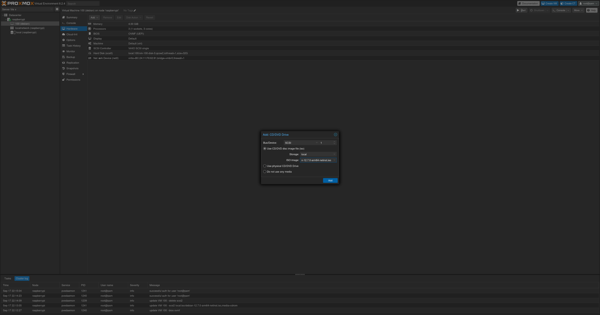

12. Now create an `EFI Disk` setting the `EFI Storage` to `local`, leave the rest as default

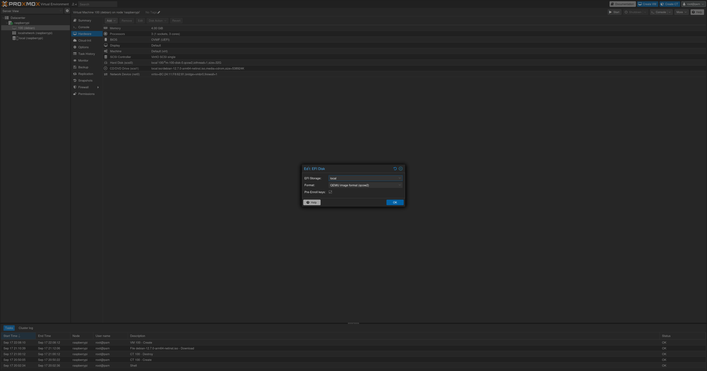

13. Now go to options and edit the `Boot Order`, placing the ISO on top of the list, then click `OK`

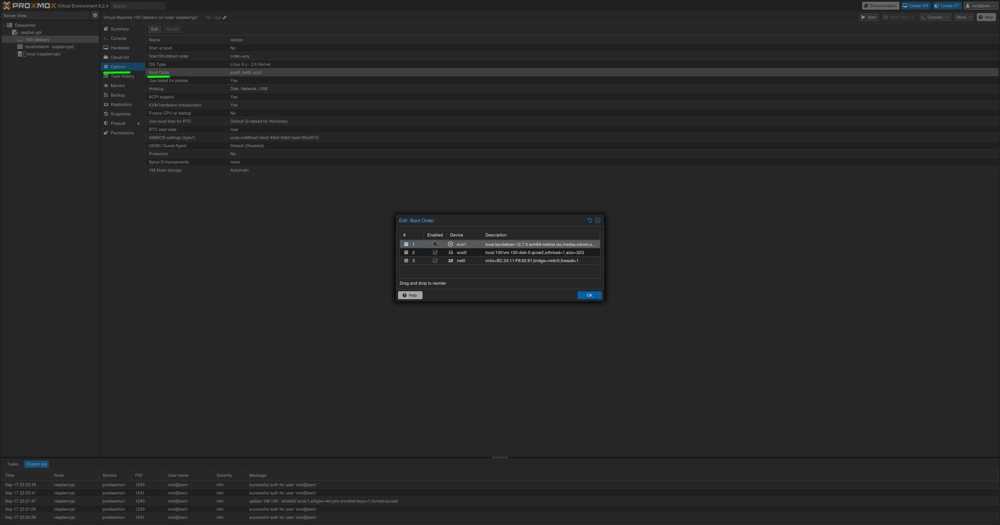

14. Now run the VM and install the system, after that go back on the `Boot Order` menu and place back the VM drive on top, after this you can use the vm

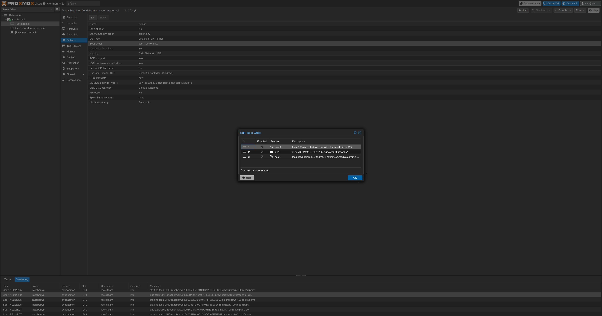

Miscellaneous
--------


#### Deactivate all LEDs

If you want to turn off all LEDs on the pi, follow these steps:

1. Open the shell and type `nano /boot/firmware/config.txt`
2. Go to the end of the file, under the  `[all]` section and add the following lines:

```
dtparam=pwr_led_trigger=default-on
dtparam=pwr_led_activelow=off
dtparam=act_led_trigger=none
dtparam=act_led_activelow=off
dtparam=eth_led0=4
dtparam=eth_led1=4
```

3. Save and reboot

#### LXC Filesystem Trimming
It may happen that you fill a container with data, then you empty it, and you may notice that on the home Summary page of the node the disk usage hasn't been updated. Here's the solution:
1. Open the shell
2. run `bash -c "$(wget -qLO - https://github.com/tteck/Proxmox/raw/main/misc/fstrim.sh)"` ([source](https://tteck.github.io/Proxmox/#proxmox-ve-lxc-filesystem-trim))

#### Add subscription
1. Once proxmox is installed, you should add a subscription to receive updates, so click on the warning and then on `Add`

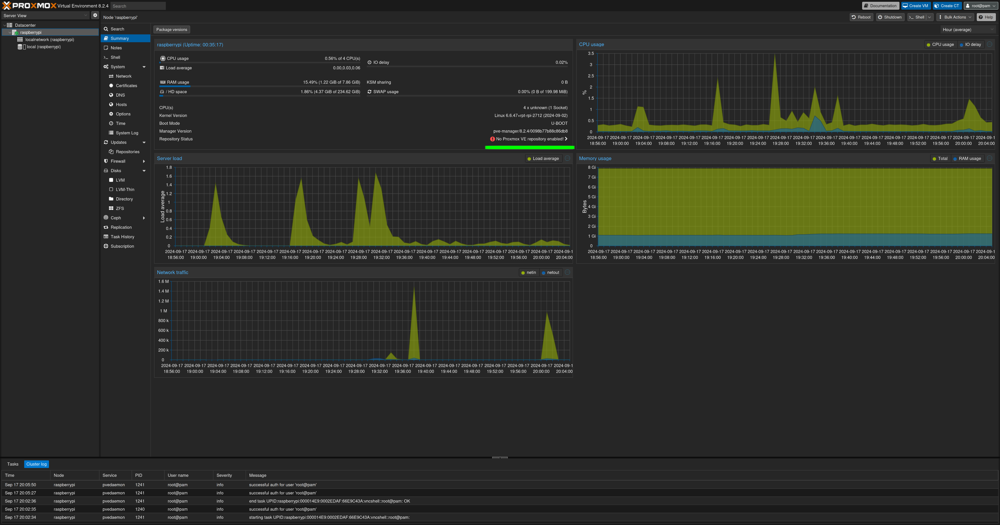

2. Now select `No-Subscription` and click on `Add`

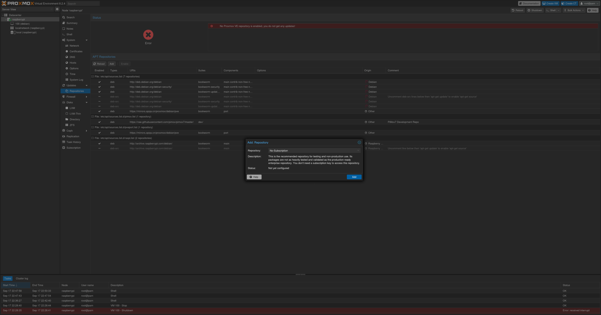

3. Open the shell and run `apt update && apt upgrade -y`

#### Disable sticky subscription alert
It might happen that the subscription alert after logging in doesn't disappear after clicking on `OK`. Here's the solution:
1. Open the shell
2. Type `passwd`
3. Enter the current proxmox password (which is the root password)
4. Try logging back in


